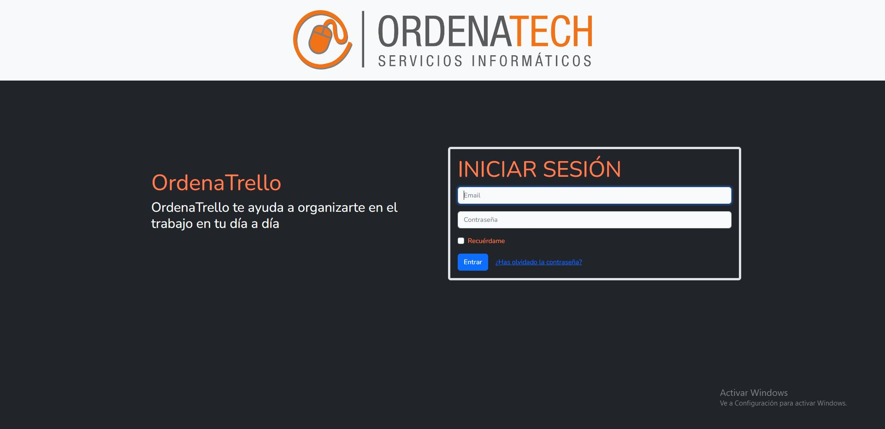
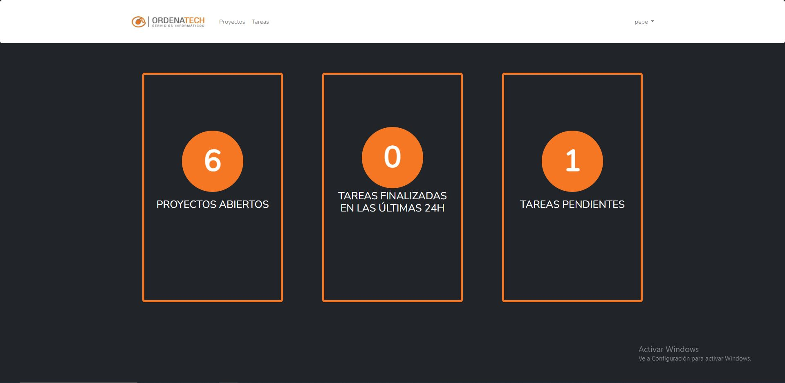
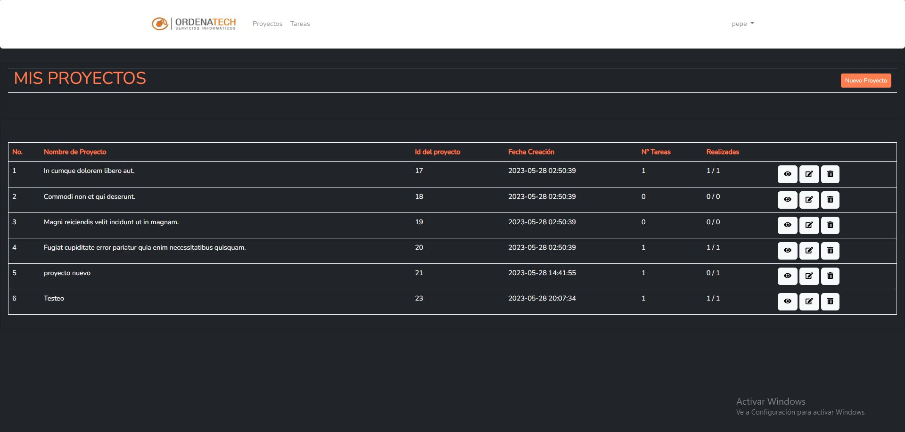
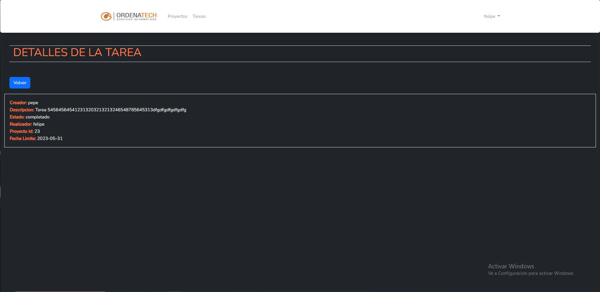

Frameworks y dependencias princnipales:

Laravel- https://laravel.com/
React- https://react-bootstrap.netlify.app/
Bootstrap- https://react-bootstrap.netlify.app/
ibex/crud-generator- https://packagist.org/packages/ibex/crud-generator
laravel/ui- https://github.com/laravel/ui
fakerphp/faker- https://fakerphp.github.io/

Screenshots:

## License

The Laravel framework is open-sourced software licensed under the [MIT license](https://opensource.org/licenses/MIT).
